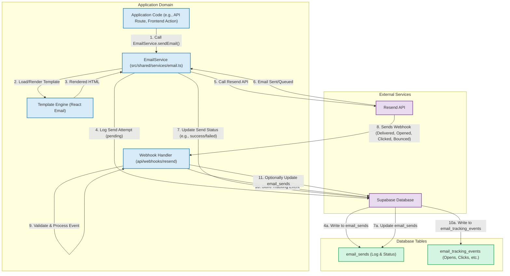

# Email Service Architecture

This document outlines the architecture of the email service used within the PHA-v2 application. It details the components involved, the data flow for sending and tracking emails, and integrations with external services.

## Diagram

## Key Components

- **Application Code**: Any part of the PHA-v2 application (frontend actions, API routes) that needs to send an email.
- **`EmailService`**: Located at `src/shared/services/email.ts`, this is the central service responsible for all email-related operations, including sending, scheduling, and interacting with the email provider.
- **Template Engine**: Utilizes React Email for rendering dynamic HTML email templates.
- **Webhook Handler**: An API route (e.g., `src/app/api/webhooks/resend/route.ts`) that receives and processes webhook events from the email provider (Resend) for tracking email status changes (delivery, opens, clicks, bounces).
- **Resend API**: The external email sending provider's API that `EmailService` interacts with.
- **Supabase Database**: Used for:
  - **`email_sends` table**: Logging all email send attempts, their parameters, and their status.
  - **`email_tracking_events` table**: Storing detailed tracking information received via webhooks.

## Email Sending Flow

1.  The **Application Code** initiates an email send request by calling a method on the `EmailService`.
2.  The `EmailService` selects the appropriate email template and uses the **Template Engine** to render it with the necessary dynamic data.
3.  The rendered HTML content is returned to the `EmailService`.
4.  The `EmailService` logs the send attempt to the `email_sends` table in the **Supabase Database** with an initial status (e.g., "pending" or "processing").
5.  The `EmailService` makes an API call to the **Resend API** to dispatch the email.
6.  The **Resend API** acknowledges the request (e.g., email queued or an immediate error).
7.  The `EmailService` updates the corresponding record in the `email_sends` table with the status from the Resend API's response.

## Email Tracking Flow

8.  The **Resend API** service sends webhook events (e.g., delivered, opened, clicked, bounced) to the application's **Webhook Handler** endpoint as they occur.
9.  The **Webhook Handler** validates the incoming webhook data and processes the event.
10. The handler stores the tracking event details in the `email_tracking_events` table in the **Supabase Database**.
11. Optionally, the handler might update the status of the original send record in the `email_sends` table based on the tracking event (e.g., update status to "delivered" or "bounced").

This architecture allows for robust email sending capabilities, comprehensive logging, and detailed tracking of email engagement.
